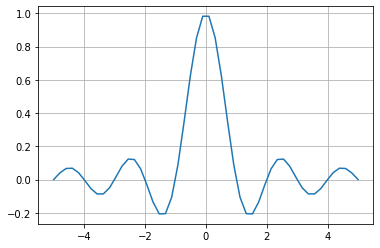

# **<font size=4 color=#BB3D00 face=微软雅黑>正弦函数</font>**

## **<font size=3  face=微软雅黑>※Matlab案例</font>** 

网址：https://ww2.mathworks.cn/help/signal/gs/the-sinc-function.html     
描述：本案例由1个示例构成。
### - <font color=DarkOrChid size=3>示例1：绘制值范围从 −5 到 5 的线性间距向量的 sinc 函数</font>

## **<font size=3 face=微软雅黑>※Python案例</font>** 

针对以上案例，采用Python语言实现。

### - <font color=DarkOrChid size=3>示例1：绘制值范围从 −5 到 5 的线性间距向量的 sinc 函数</font>

sinc 函数计算输入向量或矩阵 x 的数学正弦函数。作为时间或空间的函数，sinc 函数是以零为中心、宽度为 2π 并具有单位高度的频率的矩形脉冲的傅里叶逆变换。


```python
import numpy as np
import matplotlib.pyplot as plt
def sinc(x):
    def function(x): 
        if x==0:
            return 1
        else:
            return np.sin(np.pi*x)/(np.pi*x)
    return np.array([function(t) for t in x])
x = np.linspace(-5,5)
y=sinc(x)
plt.plot(x,y)
plt.grid()
```


    

    

