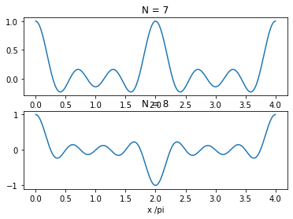

# **<font size=4 color=#BB3D00 face=微软雅黑>Dirichlet函数</font>**

diric 函数计算输入向量或矩阵 x 的 Dirichlet 函数，有时称为周期性正弦函数或混叠正弦函数。

## **<font size=3  face=微软雅黑>※Matlab案例</font>** 

网址：https://ww2.mathworks.cn/help/signal/gs/the-dirichlet-function.html     
描述：本案例由1个示例构成。
### - <font color=DarkOrChid size=3>示例1：绘制Dirichlet函数</font>

## **<font size=3 face=微软雅黑>※Python案例</font>** 

针对以上案例，采用Python语言实现。

### - <font color=DarkOrChid size=3>示例1：绘制Dirichlet函数</font>


```python
import numpy as np
import matplotlib.pyplot as plt
# 定义diric函数
def diric(x,n):
    def function(x, n):
        if abs(x)%(2*np.pi)==0:
            k=abs(x)/(2*np.pi)
            return (-1)**(k*(n-1))
        else:
            return np.sin(n*x/2)/(n*np.sin(x/2))
    y=np.array([function(t, n) for t in x])   
    return y

x= np.linspace(0,4*np.pi,300)
plt.subplot(2,1,1)
plt.plot(x/np.pi,diric(x, 7))
plt.title('N = 7')
plt.subplot(2,1,2)
plt.plot(x/np.pi,diric(x, 8))
plt.title('N = 8')
plt.xlabel('x /pi')
    
```

    Matplotlib is building the font cache; this may take a moment.
    


    Text(0.5, 0, 'x /pi')


    

    

