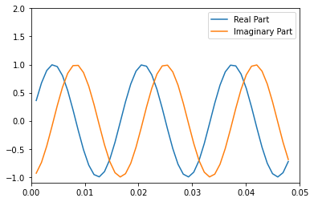

# **<font size=4 color=#BB3D00 face=微软雅黑>Hilbert变换</font>**

## **<font size=3  face=微软雅黑>※Matlab案例</font>** 

网址：https://ww2.mathworks.cn/help/signal/ug/hilbert-transform.html      
描述：本案例由1个示例构成
### - <font color=DarkOrChid size=3>示例：用Hilbert变换形成解析信号</font>

## **<font size=3 face=微软雅黑>※Python案例</font>**

针对以上案例，采用Python语言实现。

### - <font color=DarkOrChid size=3>示例：用Hilbert变换形成解析信号</font>

Hilbert 变换可用于形成解析信号。解析信号在通信领域中很有用，尤其是在带通信号处理中。scipy工具箱中的函数 hilbert 计算实数输入序列 x 的 Hilbert 变换，并返回相同长度的复数结果，即 y = hilbert(x)，其中 y 的实部是原始实数数据，虚部是实际 Hilbert 变换。在涉及到连续时间解析信号时，y 有时被称为解析信号。离散时间解析信号的关键属性是它的 Z 变换在单位圆的下半部分为 0。解析信号的许多应用都与此属性相关；例如，用解析信号避免带通采样操作的混叠效应。解析信号的幅值是原始信号的复包络。     

Hilbert 变换对实际数据作 90 度相移；正弦变为余弦，反之亦然。


```python
import numpy as np
import scipy
from scipy.signal import hilbert
import matplotlib.pyplot as plt

t = np.arange(0,1,1/1024)
x = np.sin(2*np.pi*60*t)
y = hilbert(x)

plt.plot(t[1:50],y.real[1:50],label = 'Real Part')
plt.plot(t[1:50],y.imag[1:50],label = 'Imaginary Part')
plt.axis([0,0.05,-1.1,2])
plt.legend(loc = 'upper right')
```


    <matplotlib.legend.Legend at 0x1e90dcb8fa0>


    

    


解析信号可用于计算时间序列的瞬时属性，即时间序列在任一时间点的属性。该过程要求信号是单分量的。
